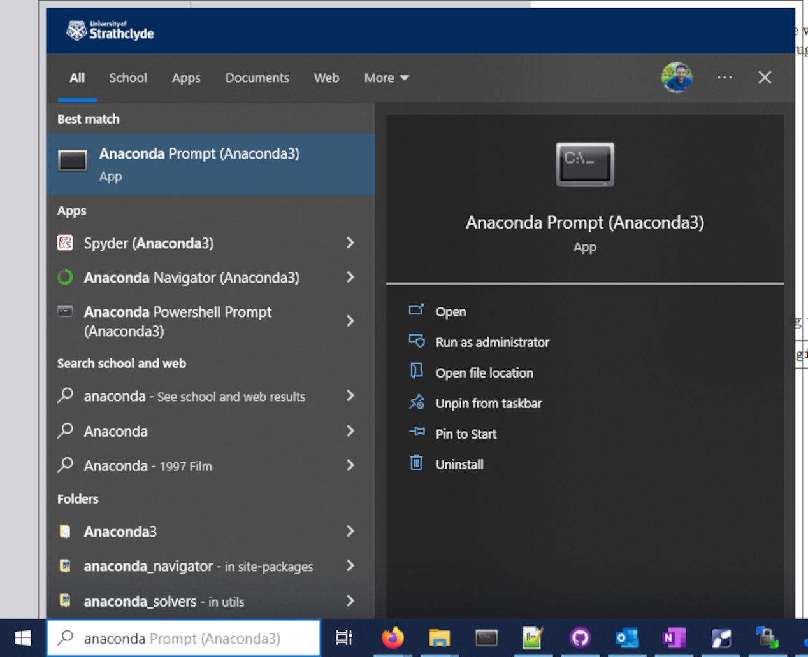
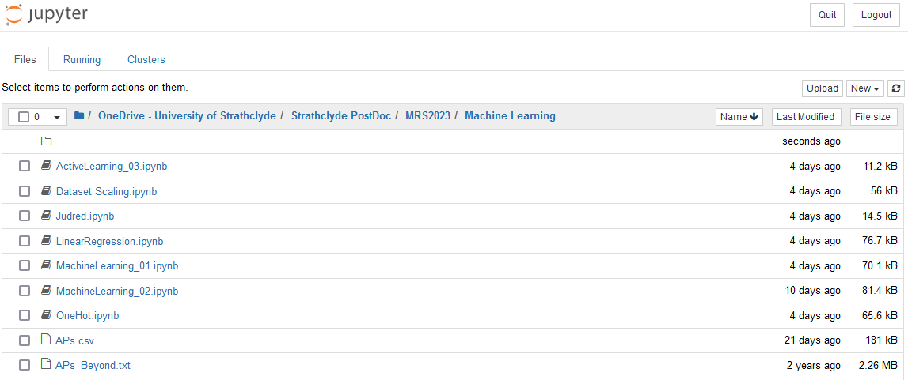

# Tutorial-SB06
Tutorial SB06 - Machine Learning for Peptide-Based Materials Design


[MRS2023 Tutorial Webpage](https://www.mrs.org/meetings-events/spring-meetings-exhibits/2023-mrs-spring-meeting/call-for-papers/tutorial-sessions-detail/2023_mrs_spring_meeting/sb06/tutorial-sb06-machine-learning-for-peptide-based-materials-design)


## Part 3 - Machine Learning

Follow along the workshop through [MRS2023_SB06_Handbook.pdf](https://github.com/avanteijlingen/Tutorial-SB06/blob/main/MRS2023_SB06_Handbook.pdf)

The Jupyter notebooks that accompany the handbook will be made availible on the day.

## Requirements:

1. Python 3
1. Jupyter
1. Numpy
1. Scipy
1. Pandas
1. Scikit-learn
1. Matplotlib


#### All required software either comes as part of  [anaconda](https://www.anaconda.com/) or can be downloaded *via* the Anaconda Promt (see below):




# On The Day

Open the command promt or anaconda navigator and clone this git repository:
```
git clone https://github.com/avanteijlingen/Tutorial-SB06
```
Open Jupyter from the start menu and browse for the Machine Learning folder within Tutorial-SB06



For the first task in the Handbook open Judred.ipynb


